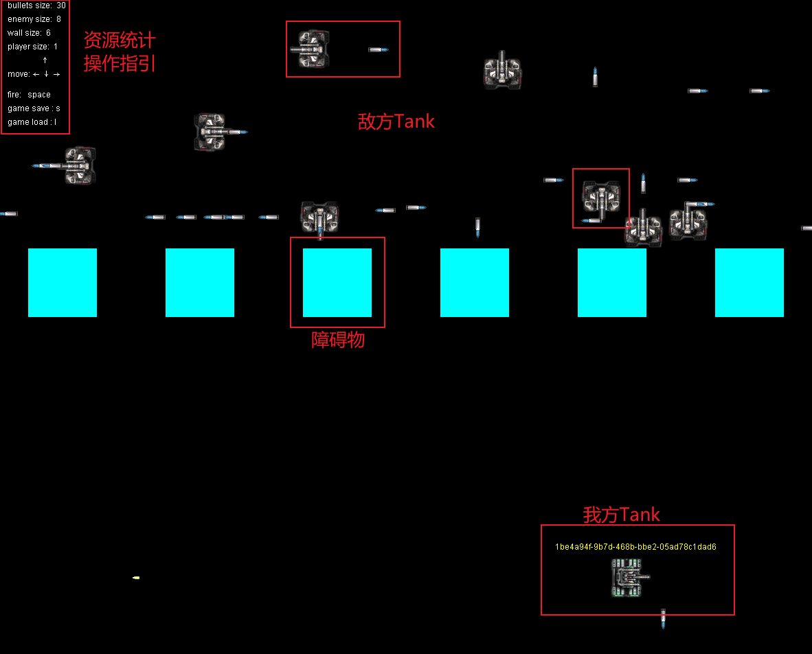
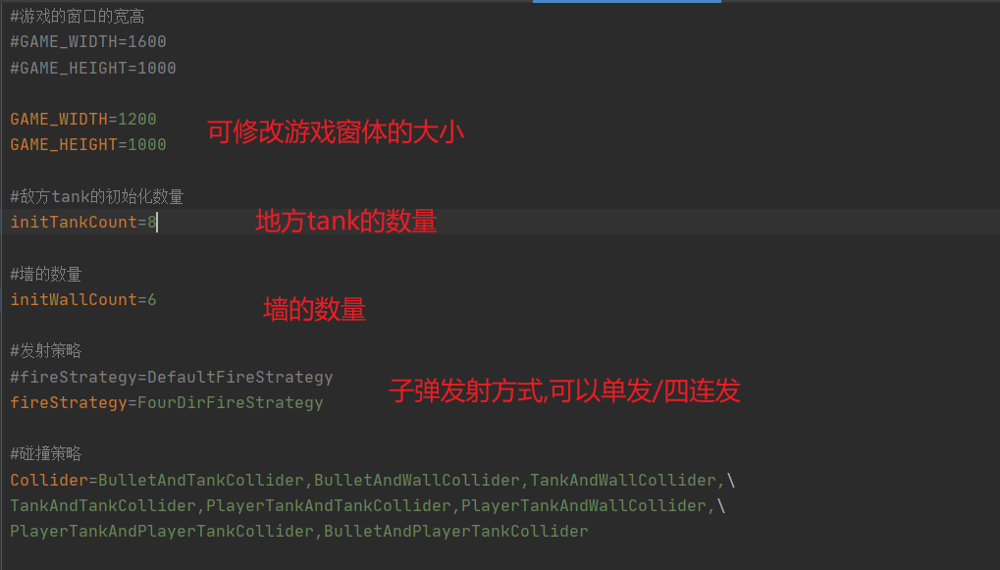
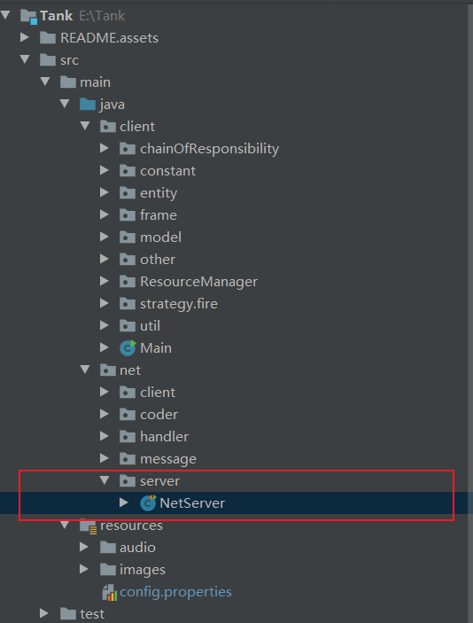
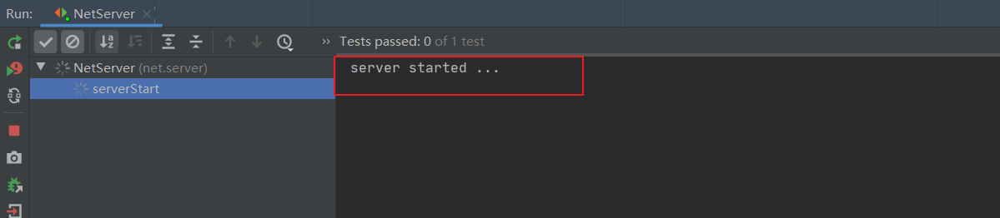
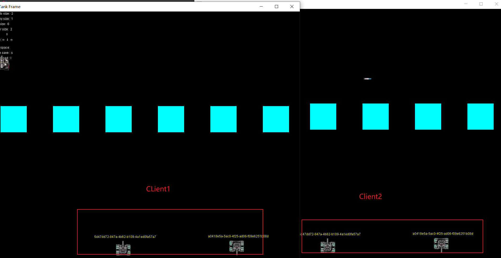

# Tank大战小游戏

## 1.单机版

1. 运行client包下的启动类Main的启动函数main即可~

   

2. 游戏可配置参数config.properties

   

3. 部分操作逻辑已经实现,大家去游戏里面探索吧!!!

## 2.网络版

1. 服务端负责数据的转发,所以先运行服务端NetServer

   

   

2. 运行两个客户端

   

   两个client实现了数据同步

## tank操作探索,交给大家和我一起探索完成,欢迎大家和我一起迭代开发tank这个项目,最后,看完觉得项目还行,点个赞,嘿嘿~

